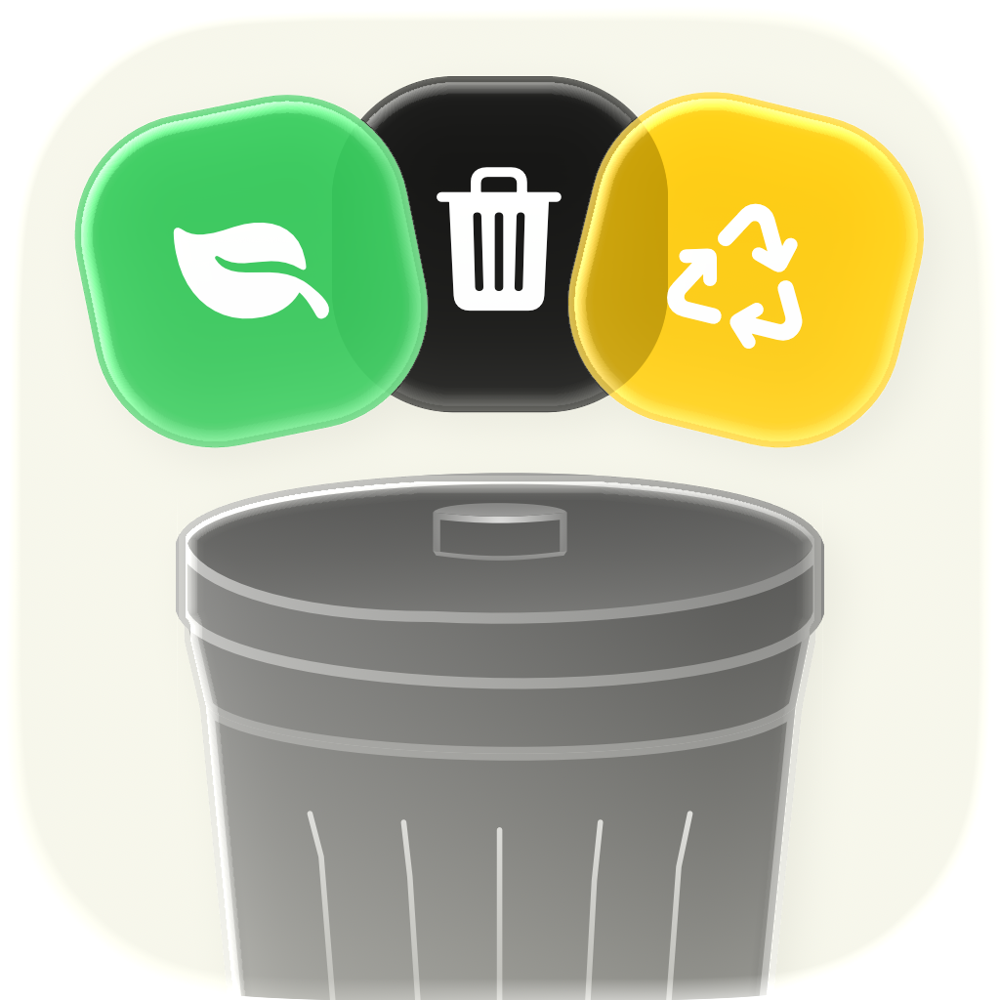
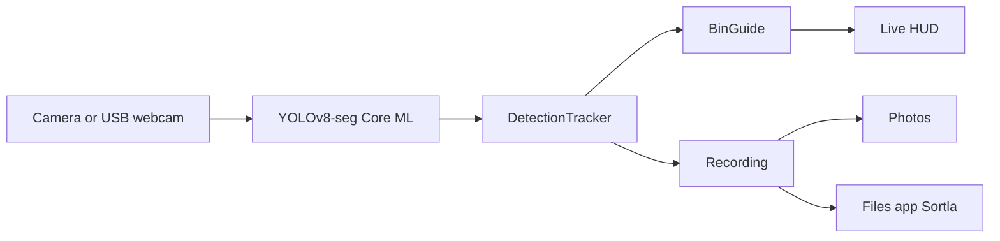

<p align="center">
  
</p>

<h1 align="center">Sortla</h1>

<p align="center">
  On-device waste sorting for iPhone and iPad.<br>
  Point a camera at trash, get a bin.
</p>

<p align="center">
  
  
  
  
  
  
</p>

Sortla is a kiosk-style camera app. Mount an iPhone or iPad above a waste station (or plug in a USB-C webcam), and it watches items in view, labels each one, and lights up the matching bin: **organic**, **residual**, or **recyclable**.

Inference runs entirely on device. Nothing is uploaded.

## Features

- **Live sorting** — YOLOv8 instance segmentation with tracked boxes, a three-segment category bar, and an FPS badge
- **Kiosk-ready** — screen stays awake; live preview defaults to 180° for an overhead mount
- **External camera** — Auto prefers a connected USB-C webcam, otherwise the back camera
- **Photo sort** — pick a still from the library and sort without the live camera
- **Recording** — raw clip to Photos; overlay clip (boxes, labels, timestamps) to Photos and Files; CSV log to Files
- **Recoverable sessions** — saves when you stop, background, or close the app; leftover recordings are recovered on next launch
- **Tunable** — swap bundled Core ML weights, confidence, overlap, and live tracking without rebuilding

Open Settings by **triple-tapping any top category** (Organic, Residual, or Recyclable) on the live HUD.

## How it works



Each frame goes through Core ML, then a tracker that holds an ID across frames (confirm hits, IoU association, EMA smoothing, time-window class vote). Confirmed tracks map to a bin via `BinGuide` and light the HUD. While recording, the same tracks are written to an overlay movie and a CSV.

| Class | Bin | Put here | Keep out |
| --- | --- | --- | --- |
| `organic` | Green / brown | Food scraps, peels, garden/plant matter | Packaging |
| `residual` | Black / grey | Tissues, diapers, styrofoam, sachets, mixed or unrecognizable | Recyclable material |
| `clean_inorganic` | Blue / yellow | Empty dry plastic (including clean bags), metal, glass, clean paper/cardboard, sticky notes | Items that may still be dirty |
| `dirty_recyclable` | Overlay only | Recyclable type that may have leftover food/drink — even at ~40–50% certainty. Rinse then recyclable, or residual as-is | Non-recyclable types |

Unrecognized classes are ignored in the live bar.

## Requirements

- A Mac with Xcode that includes the **iOS 26.5** SDK
- An iPhone or iPad (camera; USB-C webcam optional)
- Apple Developer signing for a physical device

The Simulator can build the app, but live camera, USB webcams, and recording need a device.

## Run it

1. Clone this repo and open [`waste-sort.xcodeproj`](waste-sort.xcodeproj).
2. Select the **waste-sort** scheme and a connected device.
3. Set your Development Team under Signing & Capabilities (bundle ID is `com.javohirmx.sortla`).
4. Run.

On first launch, Sortla asks for:

- **Camera** — live sorting
- **Photos** — photo sort, and saving recordings

File Sharing is on. Recorded overlay clips and CSV logs show up in the Files app under **On My iPad** / **On My iPhone → Sortla**.

## Using Sortla

**Live.** Point the camera at waste. The top bar lights the bins currently in frame. Boxes follow items after they are confirmed across a couple of frames; if the model briefly loses an item, the box freezes in place instead of sliding. The bin label stays with the item until a new class leads by confidence for a short time (default 0.4s).

**Settings.** Triple-tap any top category (Organic, Residual, or Recyclable) on the live HUD.

- **Model** — bundled weights (`best` v3.1, `bestv3.2`–`bestv3.5`); changing it reloads Live and Photo
- **Camera** — Auto (prefer USB) or a specific device; rotation and mirror apply to preview and to recordings started after the change. Software brightness, contrast, and saturation preprocess the image the model sees. Hardware exposure, focus, and white balance can be locked (USB cameras may ignore those).
- **Photo** — sort a still from the library
- **Recording** — start/stop; the live camera must be running first
- **Detection / Live tracking** — confidence, overlap, max items, confirm frames, class-change overlap, label stickiness, and box smoothing

**Recording outputs** share a local-time prefix, e.g. `Sortla-2026-08-14-150932`:

| File | Where |
| --- | --- |
| Raw camera clip | Photos |
| Overlay clip (boxes, labels, timestamps) | Photos and Files |
| Detection CSV | Files (`On My iPad/iPhone → Sortla`) |

CSV columns: timestamp, session, track ID, class, bin, confidence, model, thresholds, camera, box, FPS, event type (`first_seen`, `class_switch`, `coast_start`, `zone_deposit`), raw class.

## Models

Bundled Core ML packages live in [`waste-sort/Resources/Models/`](waste-sort/Resources/Models/):

| Settings name | Resource |
| --- | --- |
| best v3.1 | `best.mlpackage` |
| best v3.2 | `bestv3.2.mlpackage` |
| best v3.3 | `bestv3.3.mlpackage` |
| best v3.4 | `bestv3.4.mlpackage` |
| best v3.5 | `bestv3.5.mlpackage` |

Live inference uses [UltralyticsYOLO](https://github.com/ultralytics/yolo-ios-app) `>= 8.9.13` with `task: .segment`.

## Project layout

```
waste-sort/
  App/                 # composition root, kiosk idle-timer
  Features/
    Live/              # camera, YOLO view, recording
    Photo/             # library stills
    Settings/          # model, camera, thresholds
  Core/
    Detection/         # tracker, bin map, box overlay
    Camera/            # device catalog, capture locks, color preprocess
    Logging/           # JSONL session + CSV export
    Recording/         # overlay compositor / annotated writer
  Resources/Models/    # Core ML weights
waste-sortTests/       # Swift Testing
```

## Tests

From Xcode, **Product → Test** (`⌘U`). Coverage includes tracker coast/drop, class vote, geometry (rotation + mirror), camera preference fallback, overlay rendering, and CSV write/recovery (`class_switch`, `coast_start`).

## Credits

Live segmentation is powered by [Ultralytics YOLO for iOS](https://github.com/ultralytics/yolo-ios-app).
