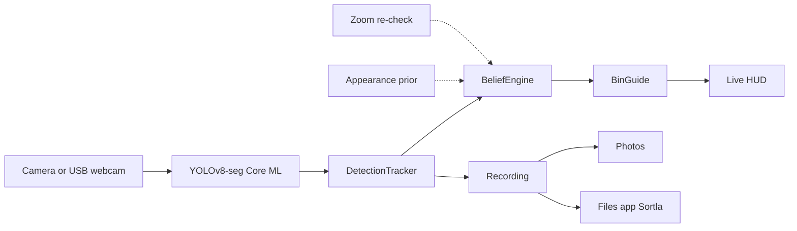

<p align="center">
  
</p>

<h1 align="center">Sortla</h1>

<p align="center">
  On-device waste sorting for iPhone and iPad.<br>
  Point a camera at trash, get a bin.
</p>

<p align="center">
  
  
  
  
  
  
</p>

Sortla is a kiosk-style camera app. Mount an iPhone or iPad above a waste station (or plug in a USB-C webcam), and it watches items in view, labels each one, and lights up the matching bin: **organic**, **residual**, or **recyclable**.

Inference runs entirely on device. Nothing is uploaded.

## Features

- **Live sorting** — YOLOv8 instance segmentation with tracked boxes, a three-segment category bar, and an FPS badge
- **Kiosk-ready** — screen stays awake; Rotation in Settings is extra on top of the camera's native orientation (overhead USB mounts often need 180°)
- **External camera** — Auto prefers a connected USB-C webcam, otherwise the back camera
- **Photo sort** — pick a still from the library and sort without the live camera
- **Recording** — raw clip to Photos; overlay clip (boxes, labels, timestamps) to Photos and Files; CSV log to Files
- **Recoverable sessions** — saves when you stop, background, or close the app; leftover recordings are recovered on next launch
- **Voice guidance** — optional spoken bin confirmations ("Organic bin") for hands-free operation
- **Haptic language** — CoreHaptics patterns per bin on correct deposits, warning buzz for wrong-bin drops
- **Siri shortcuts** — "Start Sortla recording", toggle voice guidance, cycle model weights hands-free
- **Barcode assist** — throttled Vision pass surfaces product barcodes with offline disposal hints
- **Tunable** — swap bundled Core ML weights, confidence, overlap, and live tracking without rebuilding

Open Settings by **triple-tapping any top category** (Organic, Residual, or Recyclable) on the live HUD.

## How it works



Each frame goes through Core ML, then a tracker that holds an ID across frames (confirm hits, IoU association, EMA smoothing). Every confirmed track owns a **belief engine**: a per-object class belief with recency decay that fuses the model's per-frame verdicts plus two assist signals — a color/texture prior sampled inside the box, and for items that stay *unsure*, a crop-and-rerun second pass at native resolution. A bin verdict is only spoken when the top class clears an absolute threshold **and** a margin over the runner-up; otherwise the item is honestly unsure and guided to the residual stream (Bali's last-resort bin — Pergub 47/2019 treats residu as what can be neither composted nor recycled). Deposit scoring freezes the same engine's verdict when the item vanishes into a bin.

| Class | Bin | Put here | Keep out |
| --- | --- | --- | --- |
| `organic` | Green / brown | Food scraps, peels, garden/plant matter | Packaging |
| `residual` | Black / grey | Tissues, diapers, styrofoam, sachets, mixed or unrecognizable | Recyclable material |
| `clean_inorganic` | Blue / yellow | Empty dry plastic (including clean bags), metal, glass, clean paper/cardboard, sticky notes | Items that may still be dirty |
| `dirty_recyclable` | Overlay only | Recyclable type that may have leftover food/drink — even at ~40–50% certainty. Rinse then recyclable, or residual as-is | Non-recyclable types |

Unrecognized classes are ignored in the live bar. Unsure items (dashed box, question-mark badge) are pointed at the residual bin everywhere advice is given, and the CSV marks them via `beliefUncertain` / `beliefMargin` / `modelTopClassKey` columns so accuracy work can measure where the engine overruled the model.

### Deciding between decision pipelines (the bake-off)

`Core/Evaluation` is a deterministic referee for exactly this question. Sighting streams (frames of `{class, confidence}` per object) replay through any `BinDecisionStrategy` — the repo ships two: `LegacyConfidenceStrategy`, a verbatim port of main's window-vote/lifetime-sum math, and `BeliefDecisionStrategy`, the production engine. Timestamps come from fixtures, tie-breaks are fixed, and reruns are byte-identical (`BinDecisionBakeOffTests` proves it).

The gate that decides: **confidently-wrong verdict count** — answers that were wrong while claiming certainty. Raw argmax accuracy can be won by alphabetical luck; the bundled fixtures deliberately include one flap where legacy's tie-break coin lands on truth, plus one recency-trap where legacy genuinely beats belief, so the comparison documents tradeoffs rather than cheerleading. Current result on the bundled mix: belief produces 1 confident-wrong verdict vs main's 3.

To settle it with real data instead of synthetic scenarios: enable **Verbose detection logging** (on by default) before recording — every tracked item then emits a per-frame `frame` row to the session CSV. Convert those rows into `DecisionScenario` fixtures (ground-truth labels come from reviewing the recorded clip), re-run the evaluator, and let the same gate decide.

The same choice exists at runtime: Settings → Live tracking → **Decision engine** switches between `Belief engine` and `Legacy confidence` without leaving the app. The legacy path runs the exact math above via `LegacyDecisionEngine` — including its quirks (the window vote only fires on bit-exact cutoff alignment, so confirmed labels mostly stick; relabels reach users through track respawns). Appearance and recheck assists feed beliefs and go inert under legacy.

### Roadmap: material taxonomy (v4 model)

The current three classes are the kiosk's bins, not what objects *are*. The next training round should relabel the dataset into a material taxonomy — plastic, paper, glass, metal, organic, textile, e-waste, B3/hazardous — with a fixed mapping table from materials to the three physical streams. That buys: better headroom than any post-processing (the model learns materials, the mapping layer owns regulation), B3 awareness that Pergub 47/2019 Pasal 6 requires but no current class expresses (batteries and electronics currently land in residual), and a clean path to new bins without re-architecting this pipeline — the belief engine is already generic over class keys.

## Requirements

- A Mac with Xcode that includes the **iOS 26.5** SDK
- An iPhone or iPad (camera; USB-C webcam optional)
- Apple Developer signing for a physical device

The Simulator can build the app, but live camera, USB webcams, and recording need a device.

## Run it

1. Clone this repo and open [`waste-sort.xcodeproj`](waste-sort.xcodeproj).
2. Select the **waste-sort** scheme and a connected device.
3. Set your Development Team under Signing & Capabilities (bundle ID is `com.javohirmx.sortla`).
4. Run.

On first launch, Sortla asks for:

- **Camera** — live sorting
- **Photos** — photo sort, and saving recordings

File Sharing is on. Recorded overlay clips and CSV logs show up in the Files app under **On My iPad** / **On My iPhone → Sortla**.

## Using Sortla

**Live.** Point the camera at waste. The top bar lights the bins currently in frame. Boxes follow items after they are confirmed across a couple of frames; if the model briefly loses an item, the box freezes in place instead of sliding. The bin label stays with the item until a new class leads by confidence for a short time (default 0.4s).

**Settings.** Triple-tap any top category (Organic, Residual, or Recyclable) on the live HUD.

- **Model** — bundled weights (`best` v3.1, `bestv3.2`–`bestv3.6`); changing it reloads Live and Photo
- **Camera** — Auto (prefer USB) or a specific device; rotation is extra on top of the camera's native orientation (overhead USB mounts often need 180°) and applies to preview and to recordings started after the change. Software brightness, contrast, and saturation preprocess the image the model sees. Hardware exposure, focus, and white balance can be locked (USB cameras may ignore those).
- **Photo** — sort a still from the library
- **Recording** — start/stop; the live camera must be running first
- **Detection / Live tracking** — confidence, overlap, max items, confirm frames, class-change overlap, label stickiness, and box smoothing

**Recording outputs** share a local-time prefix, e.g. `Sortla-2026-08-14-150932`:

| File | Where |
| --- | --- |
| Raw camera clip | Photos |
| Overlay clip (boxes, labels, timestamps) | Photos and Files |
| Detection CSV | Files (`On My iPad/iPhone → Sortla`) |

CSV columns: timestamp, session, track ID, class, bin, confidence, model, thresholds, camera, box, FPS, event type (`first_seen`, `class_switch`, `coast_start`, `zone_deposit`), raw class.

## Models

Bundled Core ML packages live in [`waste-sort/Resources/Models/`](waste-sort/Resources/Models/):

| Settings name | Resource |
| --- | --- |
| best v3.1 | `best.mlpackage` |
| best v3.2 | `bestv3.2.mlpackage` |
| best v3.3 | `bestv3.3.mlpackage` |
| best v3.4 | `bestv3.4.mlpackage` |
| best v3.5 | `bestv3.5.mlpackage` |
| best v3.6 | `bestv3.6.mlpackage` |

Live inference uses [UltralyticsYOLO](https://github.com/ultralytics/yolo-ios-app) `>= 8.9.13` with `task: .segment`.

## Project layout

```
waste-sort/
  App/                 # composition root, kiosk idle-timer
  Features/
    Live/              # camera, YOLO view, recording
    Photo/             # library stills
    Settings/          # model, camera, thresholds
    Intents/           # Siri App Intents + shortcuts
    Stats/ History/ Onboarding/ BinSettings/
  Core/
    Detection/         # tracker, bin map, box overlay
    Camera/            # device catalog, capture locks, color preprocess
    Logging/           # JSONL session + CSV export, per-session logger
    Recording/         # overlay compositor, recovery, photo saver, rotation math
    Feedback/          # speech guidance, haptic language
    Vision/            # barcode frame scanner
  Resources/Models/    # Core ML weights
waste-sortTests/       # Swift Testing
```

See [AGENTS.md](AGENTS.md) for the threading model and conventions any
contributor (human or AI) must follow.

## Tests

From Xcode, **Product → Test** (`⌘U`), or:

```bash
xcodebuild test -scheme waste-sort \
  -destination 'platform=iOS Simulator,name=iPhone 17 Pro,OS=26.5'
```

Coverage includes tracker coast/drop, class vote, geometry (rotation + mirror),
camera preference fallback, overlay rendering, CSV write/recovery
(`class_switch`, `coast_start`), recovery service, rotation math, voice/barcode
guidance phrases, and the recording phase mirror. `swiftlint lint` must stay at
zero errors (config: `.swiftlint.yml`).

## Credits

Live segmentation is powered by [Ultralytics YOLO for iOS](https://github.com/ultralytics/yolo-ios-app).
